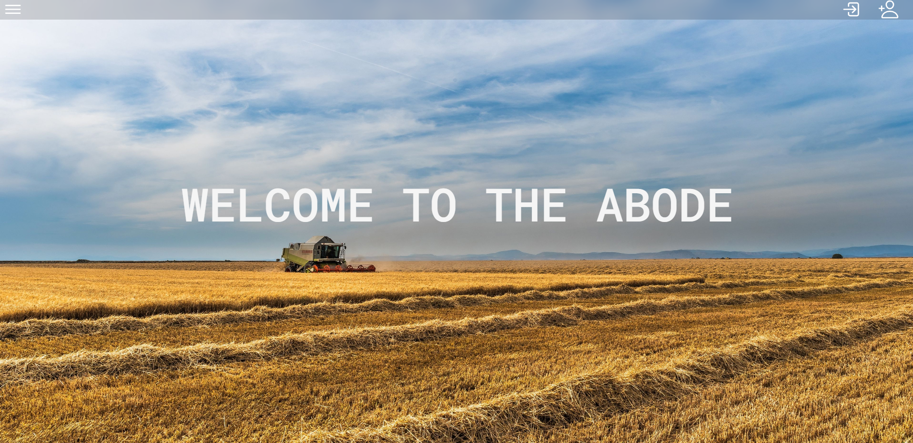
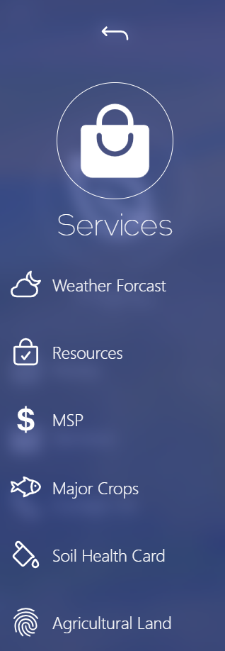
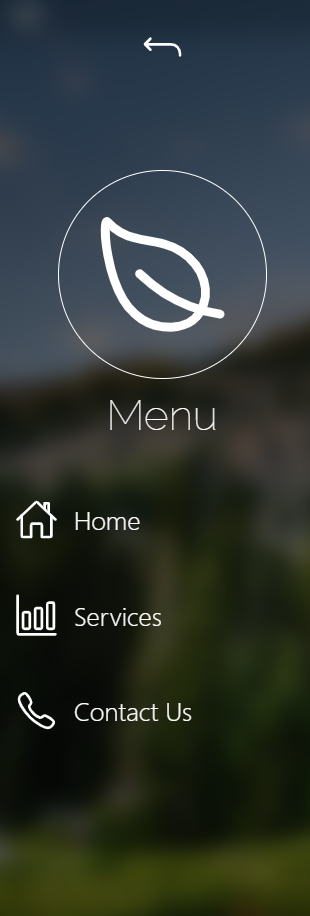
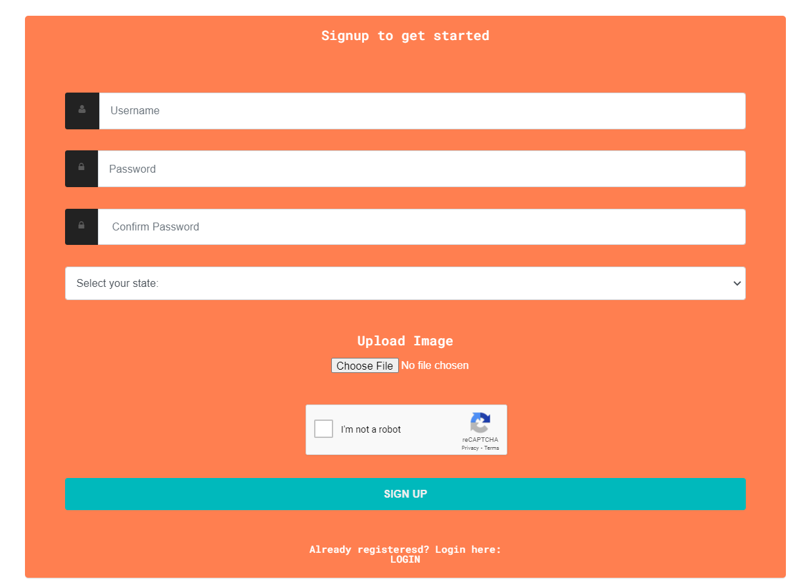
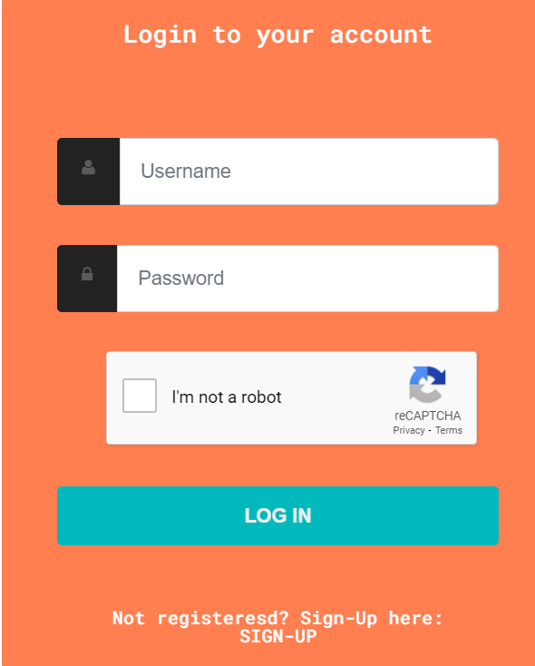
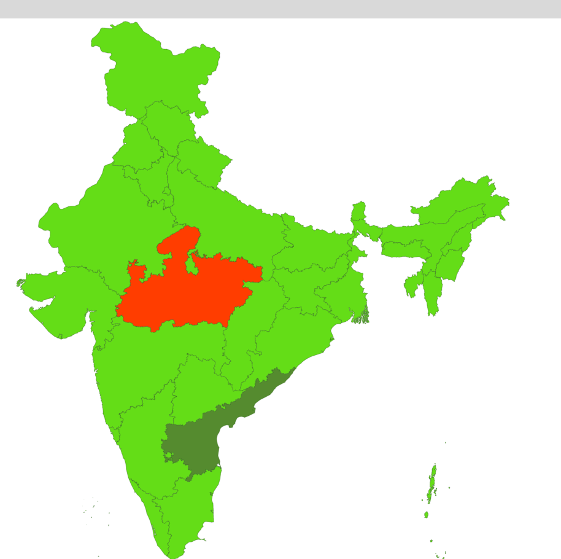
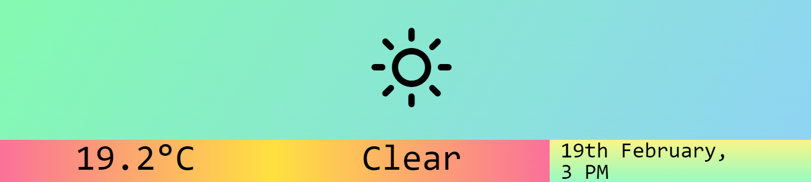

 <h1 align="center"> FARMERX  The ultimate goal of farming is not the growing of crops, but the cultivation and perfection of human beings.  
 
<h2 align="center">

[Website Link](https://farmerx.000webhostapp.com/)

## LOGO

## Features

* Connect to Global Market
* Wheather Forecast
* MSP
* Login/SignUp
* Maps

## Setup

* Clone this repository.
* Install XAMPP.
* Visit localhost/phpmyadmin in your browser.
* Create a new database named users
* Import users.sql
* Start Apache Server and MySQL in XAMPP.
* Visit localhost/farmerX/ in your browser.

## Screenshot

## 🔆 Tech Stack

-  PHP: 66.7 %
-  JavaScript: 21.2%
-  CSS: 12.1 %

## 📝 Learning Resources

Read these articles to get a quick grab on Php and other technologies used in the project:

### Resources for PHP:
- https://www.php.net/manual/en/index.php
- https://www.w3schools.com/php/

### Resources to learn Git and Github:
- https://try.github.io/
- https://docs.github.com/en/github/getting-started-with-github/git-and-github-learning-resources
- https://guides.github.com/activities/hello-world/

# This project is a part of Hack-It-Out 2021 👣

 ## 💻 Development guidelines

1.  Put all the code in one of the existing files in  `/src`.
    
3.  Push all the code to your own branch. Once you are sure it is working, merge it with the `dev`  branch. Let's maintain only the stable and released versions on the  `master`  branch.
    
4.  Write a powerful, readable, and clean code.

##  💼  Code of Conduct

We want to facilitate a healthy and constructive community behavior by adopting and enforcing our code of conduct.
Please adhere toward our [Code-of-Conduct](Code-of-Conduct.md).

## License
[MIT](https://choosealicense.com/licenses/mit/)

### Like This? Star ⭐ this repository.

💜 **Thanks**
